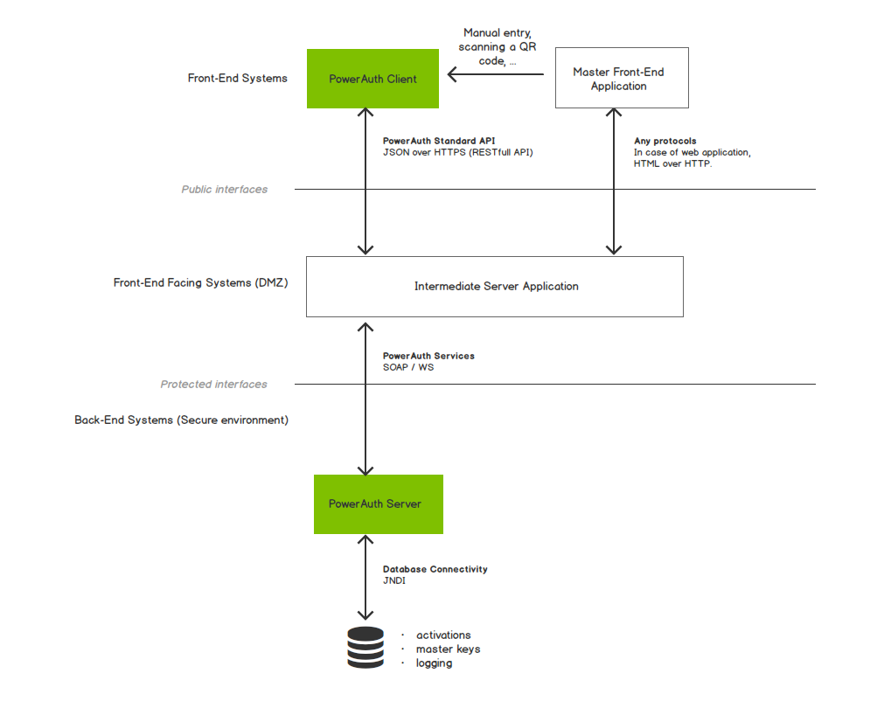
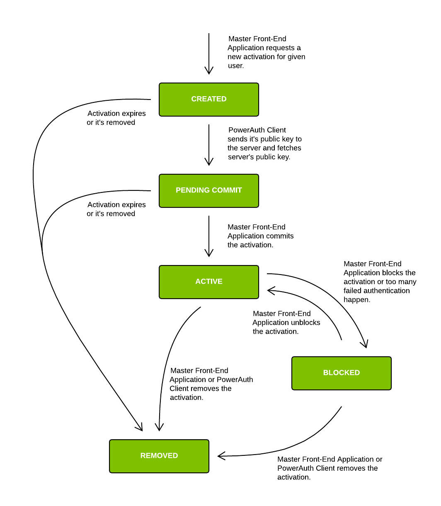
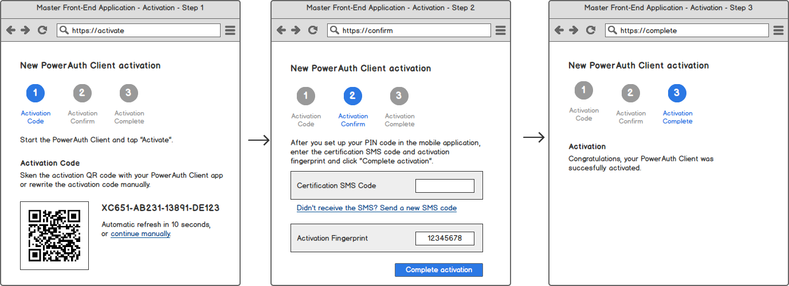
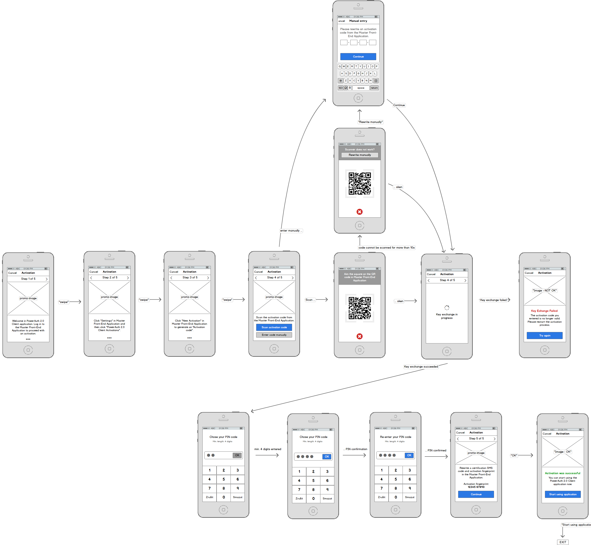
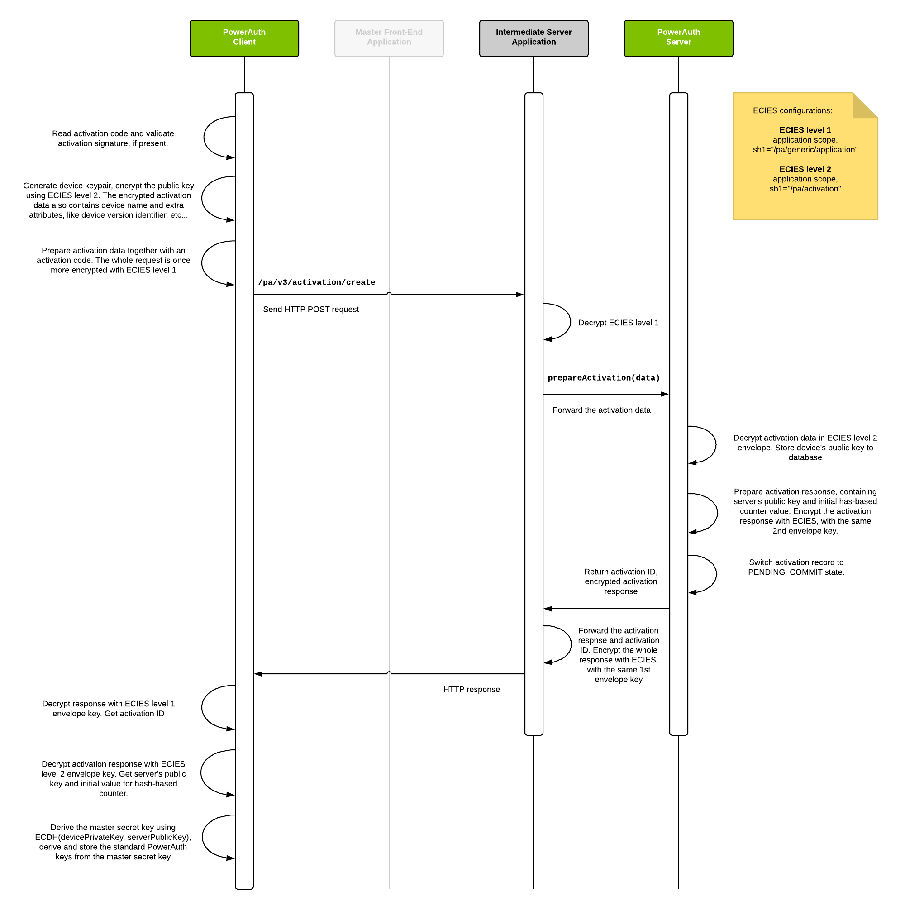

# Activation

In PowerAuth, both client and server must first share the same shared master secret `KEY_MASTER_SECRET`. The `KEY_MASTER_SECRET` is a symmetric key that is used as a base for deriving the further purpose specific shared secret keys. These derived keys are then used for an HTTP request signing. In order to establish this shared master secret, a secure key exchange (or "activation") must take a place.

## Activation Actors

Following components play role in activation:

- **PowerAuth Client** - A client "to be activated" application, that implements PowerAuth protocol. A good example of a typical PowerAuth Client can be a mobile banking application.
- **Master Front-End Application** - An application that initiates the activation process and helps the PowerAuth Client start the key exchange algorithm. Example of Master Front-End Application can be an Internet banking.
- **Intermediate Server Application** - A front-end facing server application (or a set of applications, that we currently view as a single unified system, for the sake of simplicity) that is deployed in demilitarized zone in order to accommodate a communication between PowerAuth Client, Master Front-End Application and PowerAuth Server. A good example of Intermediate Server Application is a mobile banking RESTful API server.
- **PowerAuth Server** - A server application hidden deep in secure infrastructure, stores activation records, or verifies the request signatures. This application provides services for Intermediate Server Application to implement the PowerAuth protocol. An example of a PowerAuth Server is a bank identity management system.




## Activation States

Record associated with given PowerAuth keys transits between following states during it's lifecycle:

- **CREATED** - The activation record is created but it was not activated yet.
- **OTP_USED** - The activation record is created and activation code was already used, but the activation record was not activated yet.
- **ACTIVE** - The activation record is created and active, ready to be used for generating signatures.
- **BLOCKED** - The activation record is blocked and cannot be used for generating signatures. It can be renewed and activated again.
- **REMOVED** - The activation record is permanently blocked - cannot be used for generating signatures or renewed.

After the key exchange is initiated, an activation record is created in the database in the CREATED state. In subsequent requests, client application must complete the activation. The system that initiated the activation (such as the web interface) must push the status of the token to the ACTIVE state before it can be used.

Following diagram shows transitions between activation states in more detail:



## Activation User Flow

From the user perspective, PowerAuth activation is performed as a sequence of steps in PowerAuth Client and Master Front-End Application. Following steps (with possible UI / UX alterations) must be performed:

### Master Front-End Application

Following diagram shows example steps in Master Front-End Application - imagine the Internet banking as an example application.





### PowerAuth Client

Following diagram shows example steps in PowerAuth Client - imagine the Mobile banking as an example application.



## Activation Flow - Sequence Diagram

The sequence diagrams below explain the PowerAuth key exchange. It shows how PowerAuth Client, Intermediate Server Application, Master Front-End Application and PowerAuth Server play together in order to establish a shared secret between the client application and PowerAuth Server.

For the sake of the simplicity, we have split the process into three diagrams. The details of individual steps can be found in the chapter below ("Activation Flow - Description").

### Activation Initialization

This diagram shows how Master Front-End Application requests the activation data from the PowerAuth Server. The process is initiated by the Master Front-End Application (for example, the Internet banking in the web browser) and it also ends here: by displaying the activation data so that they can be entered in the PowerAuth Client.


### Key Exchange

This diagram shows how public keys are exchanged between PowerAuth Client and PowerAuth Server, and how  master shared secret and PowerAuth Standard Keys are derived. The Master Front-End Application plays no active role in the process of a key exchange.



### Activation Commit

Finally, the last diagram shows how Master Front-End Application proactively checks the status of the activation and allows it's completion by committing the activation record. A PowerAuth Client plays a very little role in this step - it only shows a public key fingerprint so that the key exchange can be confirmed before committing the activation.


## Activation Flow - Description

To describe the steps more precisely, the activation process is performed in following steps:

1. Master Front-End Application requests a new activation for a given user.

1. PowerAuth Server generates an `ACTIVATION_ID`, `ACTIVATION_CODE`, `CTR_DATA` - an initial value for hash based counter, and a key pair `(KEY_SERVER_PRIVATE, KEY_SERVER_PUBLIC)`. Server also optionally computes a signature `ACTIVATION_SIGNATURE` of `ACTIVATION_CODE` using servers master private key `KEY_SERVER_MASTER_PRIVATE`.
   ```java
   String ACTIVATION_ID = Generator.randomUUID()
   String ACTIVATION_CODE = Generator.randomActivationCode()  // must be unique among records in CREATED and OTP_USED states
   byte[] CTR_DATA = Generator.randomBytes(16)
   KeyPair keyPair = KeyGenerator.randomKeyPair()
   PrivateKey KEY_SERVER_PRIVATE = keyPair.getPrivate()
   PublicKey KEY_SERVER_PUBLIC = keyPair.getPublic()
   byte[] DATA = ACTIVATION_CODE.getBytes("UTF-8")
   byte[] ACTIVATION_SIGNATURE = ECDSA.sign(DATA, KEY_SERVER_MASTER_PRIVATE)
   ```

1. Record associated with given `ACTIVATION_ID` is now in `CREATED` state.

1. Master Front-End Application receives an `ACTIVATION_CODE` and `ACTIVATION_SIGNATURE` (optional) and displays these information visually in the front-end so that a user can rewrite them in PowerAuth Client.

1. User enters `ACTIVATION_CODE`, and `ACTIVATION_SIGNATURE` (optional) in the PowerAuth Client, for example using manual entry or by scanning a QR code with activation data.

1. (optional) PowerAuth Client verifies `ACTIVATION_SIGNATURE` against `ACTIVATION_CODE` using `KEY_SERVER_MASTER_PUBLIC` and if the signature matches, it proceeds.
   ```java
   byte[] DATA = ACTIVATION_CODE.getBytes("UTF-8")
   boolean isOK = ECDSA.verify(DATA, ACTIVATION_SIGNATURE, KEY_SERVER_MASTER_PUBLIC)
   ```

1. PowerAuth Client generates its key pair `(KEY_DEVICE_PRIVATE, KEY_DEVICE_PUBLIC)`.
   ```java
   KeyPair keyPair = KeyGenerator.randomKeyPair()
   PrivateKey KEY_DEVICE_PRIVATE = keyPair.getPrivate()
   PublicKey KEY_DEVICE_PUBLIC = keyPair.getPublic()
   ```

1. PowerAuth Client encrypts payload containing `KEY_DEVICE_PUBLIC` with an application scoped ECIES (level 2, `sh1="/pa/activation"`). Let's call the result of this step as `ACTIVATION_DATA`.

1. PowerAuth Client encrypts payload containing `ACTIVATION_DATA` and `ACTIVATION_CODE` with an application scoped ECIES (level 1, `sh1="/pa/generic/application"`) and sends HTTPS request to the `/pa/v3/activation/create` endpoint.

1. Intermediate Server Application decrypts ECIES envelope, with an application scoped ECIES (level 1, `sh1="/pa/generic/application"`) and asks PowerAuth Server to move activation to the next step. At this step, the `ACTIVATION_CODE` can be used to identify the pending activation.

1. PowerAuth Server receives `ACTIVATION_CODE` and `ACTIVATION_DATA` from Intermediate Server Application. The `ACTIVATION_CODE` identifies the record for a pending activation. If the record is unknown, then server returns a generic error.

1. PowerAuth Server decrypts `ACTIVATION_DATA` with using an application scoped ECIES (level 2, `sh1="/pa/activation"`) and stores `KEY_DEVICE_PUBLIC` at given record.

1. PowerAuth Server changes the record status to `OTP_USED`.

1. PowerAuth Server encrypts response, containing `ACTIVATION_ID`, `CTR_DATA`, `KEY_SERVER_PUBLIC` with the same key as was used for ECIES level 2 decryption. This data is once more time encrypted by Intermediate Server Application, with the same key from ECIES level 1, and the response is sent to the PowerAuth Client. 

1. PowerAuth Client decrypts the response with both levels of ECIES, in the right order and receives `ACTIVATION_ID`, `KEY_SERVER_PUBLIC`, `CTR_DATA` and stores all that values locally on the device.

1. (optional) PowerAuth Client displays `H_K_DEVICE_PUBLIC`, so that a user can verify the device public key correctness by entering `H_K_DEVICE_PUBLIC` in the Master Front-End Application (Master Front-End Application sends `H_K_DEVICE_PUBLIC` for verification to PowerAuth Server via Intermediate Server Application).
   ```java
   byte[] activationIdBytes = ACTIVATION_ID.getBytes("UTF-8")
   byte[] fingerprintBytes = ByteUtils.concat(K_DEVICE_PUBLIC_BYTES, ByteUtils.concat(activationIdBytes, K_SERVER_PUBLIC_BYTES))
   byte[] truncatedBytes = ByteUtils.truncate(Hash.sha256(KeyConversion.getBytes(fingerprintBytes), 4)
   int H_K_DEVICE_PUBLIC = ByteUtils.getInt(truncatedBytes) & 0x7FFFFFFF) % (10 ^ 8)
   ```
   _Note: Client and server should check the client's public key fingerprint before the shared secret established by the key exchange is considered active. This is necessary so that user can verify the exchanged information in order to detect the MITM attack. (Displaying fingerprint of the server key is not necessary, since the server's public key is signed using server's private master key and encrypted with activation OTP and server public key)._

1. PowerAuth Client uses `KEY_DEVICE_PRIVATE` and `KEY_SERVER_PUBLIC` to deduce `KEY_MASTER_SECRET` using ECDH.
   ```java
   KEY_MASTER_SECRET = ECDH.phase(KEY_DEVICE_PRIVATE, KEY_SERVER_PUBLIC)
   ```

1. PowerAuth Server uses `KEY_DEVICE_PUBLIC` and `KEY_SERVER_PRIVATE` to deduce `KEY_MASTER_SECRET` using ECDH.
   ```java
   KEY_MASTER_SECRET = ECDH.phase(KEY_SERVER_PRIVATE, KEY_DEVICE_PUBLIC)
   ```

1. Master Front-End Application allows completion of the activation - for example, it may ask user to enter a code delivered via an SMS message. Master Front-End Application technically commits the activation by calling PowerAuth Server (via Intermediate Server Application).

1. Record associated with given `ACTIVATION_ID` is now in `ACTIVE` state.

After completing the activation, client must store derived keys and throw away unencrypted device private key and key master secret. Only the derived keys should be stored on the device according to the description in "PowerAuth Key Derivation" chapter.
